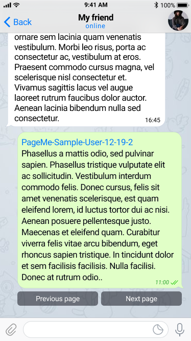
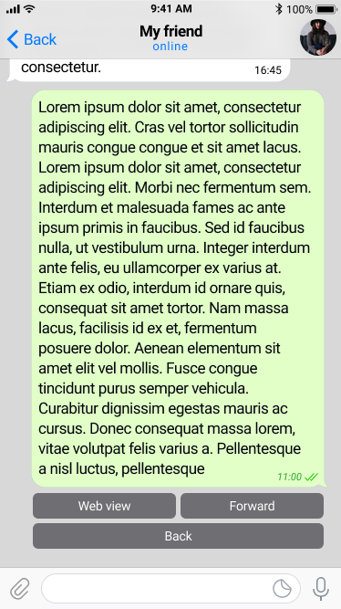

# FOLIOBOT FOR TELEGRAM

> Here is a [@foliobot](https://t.me/foliobot) — pagination bot for [Telegram](https://t.me/).
> 
> The [@foliobot](https://t.me/foliobot) can beautify your large Telegram post :postbox: with the pretty pagination keyboard instead the sad _"More.."_.

## How to use?

First you need to press `Start` in [@foliobot](https://t.me/foliobot) chat. And get a Telegraph account (_bot make it automatically. It's not corresponing to oficial [@telegraph](https://t.me/telegraph) accounts_).

Then you can start in this several ways.

### First step

1. Send any text above 600 signs lenght in [@foliobot](https://t.me/foliobot) chat.

2. Forward large message from any chat to [@foliobot](https://t.me/foliobot).

3. Send command `/create` in [@foliobot](https://t.me/foliobot) chat and follow the instructions.

4. Send [Telegraph link](http://telegra.ph/) in [@foliobot](https://t.me/foliobot) chat.

### Second step

When you chosen addressee for your _forwarding page you will see an `inline request` in chat with him/her. Press on it!

### DONE!

### Other way

Use oficial [@telegraph](https://t.me/telegraph) bot to make your page.

Then start `inline query` @foliobot in target chat with link to Telegraph's page.

### Options

Press on middle button `1 · 3` to get the additional options.

If you forward this folio from the menu it have been forwarded with current page.

## Donate

